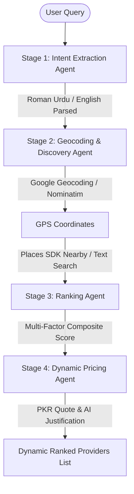

# 🚀 IntelliServe — Autonomous Multi-Agent Service Orchestrator

IntelliServe is an advanced, fully autonomous **Agentic AI platform** designed to revolutionize the informal home services economy in Pakistan (plumbers, electricians, tutoring academies, beauticians, and more). 

Built for the **Google Antigravity Hackathon**, IntelliServe replaces the chaos of WhatsApp groups and informal word-of-mouth referrals with a structured, multi-stage AI reasoning pipeline. The system geocodes natural language locations, fetches real business data in real-time using Google Maps, ranks providers on transparent metrics, and justifies quotes dynamically.

---

## 🎨 The "Sunrise" Design System & Premium UX
The application is wrapped in a bespoke **Sunrise-inspired aesthetic** featuring:
- **Premium Color Palette**: Warm cream base (`#fdf6ee`) paired with a vibrant, high-contrast signature orange (`#ff5500`).
- **Glassmorphism Layering**: Deep navy/cyan blur backdrops with translucent cards, smooth micro-interactions, and vibrant drop shadows.
- **Dynamic Live Badge**: A pulsing real-time indicator that visually reassures the user they are connected directly to live Google Maps data.
- **Simplified Feedback Loop**: Clean post-service rating UI with instant feedback confirmation, stripping away complex raw developer logs for a premium user experience.

---

## 🧠 System Architecture & The 4-Stage Agentic Pipeline
IntelliServe completely avoids rigid hardcoded logic. Every search processes through an autonomous chain of specialized AI agents:



### 1. Intent Extraction Agent (NLU Parser)
* **Goal**: Parses highly informal, multi-lingual, or mixed Roman Urdu & English queries (e.g., *"Mujhe kal subah DHA Phase 5 mein tutor chahiye"*).
* **Output**: Extracts structured parameters including `service_type`, `location` (e.g., DHA Phase 5), `time_preference` (e.g., subah), and `urgency`.

### 2. Geocoding & Discovery Agent (Real-World Connection)
* **Smart Geocoding**: Resolves typed sectors to real-world latitude/longitude coordinates (with automatic sector expansion; e.g., typing `"5"` generates G-5/F-5 variants to prevent city-wide defaults).
* **Dual-Layer Discovery**: 
  1. **Category Search**: Queries the browser Google Places API using specific place categories (e.g., `beauty_salon`, `plumber`).
  2. **Direct Text Search Fallback**: If a category returns zero results (very common for custom services like `tutor` or `academy` in Pakistan), it immediately cascades to a natural-language `searchByText` (e.g., *"academy in DHA Lahore"*).
* **Zero-Mock Integrity**: If no real business is listed on Google Maps, the app displays a beautiful **"No Providers Found"** empty state screen instead of showing misleading mock data.

### 3. Multi-Factor Ranking Agent (Scoring engine)
* **Process**: Scores the discovered real-world providers using a transparent, multi-criteria weight matrix:
  $$\text{Composite Score} = (0.35 \times \text{Distance}) + (0.30 \times \text{Rating}) + (0.20 \times \text{Reliability}) + (0.15 \times \text{Availability})$$
* **Output**: Renders an intuitive composite index (out of 100) and displays a drop-down detailing exactly **"Why this ranking?"** so users trust the choices.

### 4. Dynamic Pricing & Justification Agent
* **Quote Engine**: Calculates a hyper-local Pakistan Rupee (PKR) price quote based on provider distance, sector demand, and active hours.
* **AI Justification**: Explains precisely how the price was formulated (e.g., base travel fees plus emergency diagnostic surcharges) to eliminate hidden pricing structures.

---

## 🛡️ Resilience & Fallback Engineering
To ensure a highly resilient hackathon demo, IntelliServe implements robust safety nets:
1. **API Limit Waiting States**: If the Gemini API hits rate limits, the UI gracefully displays a professional *"Wait for a Moment..."* loading state, continuing in the background without crashing the interface.
2. **Dual-Provider Geocoding**: If Google Geocoding hits billing limits, it transparently cascades to **OSM Nominatim Geocoding** to guarantee coordinates are always retrieved.
3. **Browser CORS-Safe Places Integration**: Discoveries bypass backend proxy bottlenecks entirely by querying Google Places directly from the client browser session.

---

## 📅 Premium Integrations
- **"Add to Cal" (Google Calendar)**: Real-time dynamic URL generator. On booking completion, it populates a calendar event pre-filled with the provider's business name, localized service type, booking ID, and localized PKR quote details.

---

## 🐳 Dockerization & Deployment
IntelliServe is containerized for simple one-command deployments (fully compatible with **Google Cloud Run**).

### Build & Run Locally
1. Build the Docker image:
   ```bash
   docker build -t intelliserve-app .
   ```
2. Run the container:
   ```bash
   docker run -p 8080:8080 intelliserve-app
   ```
3. Open `http://localhost:8080` in your web browser.

---

## 🛠️ Tech Stack & Dependencies
- **Frontend Core**: React 18, Vite, HSL-tailored Hued Vanilla CSS
- **Orchestration**: Google Gemini API SDK
- **Geocoding**: Google Geocoding API & OpenStreetMap Nominatim
- **Real-World Discovery**: Google Places SDK (New)
- **Deployment**: multi-stage Docker / Nginx SPA configuration
- .
